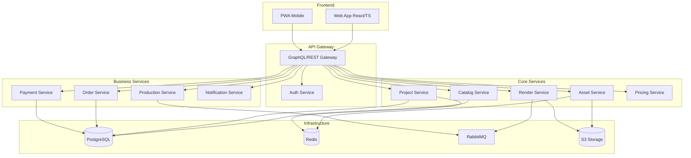

# Documento de Design - Editor Online de Produtos Personalizados

## Visão Geral

O sistema será implementado como uma arquitetura de microserviços com frontend React/TypeScript e backend Node.js, projetado para alta disponibilidade, escalabilidade e performance. A solução atende consumidores finais (B2C) e varejistas (B2B2C) com funcionalidades white-label.

### Objetivos de Performance
- Taxa de conversão: >6%
- Tempo médio de criação: <15 min
- SLA de render: <30s previews, <120s render final
- Taxa de erro de produção: <0,5%
- Abandono de editor: <25%

## Arquitetura

### Arquitetura Geral



### Stack Tecnológico

**Frontend:**
- React 18 + TypeScript
- Vite (build tool)
- Zustand (state management)
- React Query (data fetching)
- Canvas API + WebGL (editor)
- Tailwind CSS + Headless UI
- React Hook Form + Zod (validação)
- i18next (internacionalização)
- PWA com Workbox

**Backend:**
- Node.js + NestJS
- GraphQL (Apollo Server) + REST
- PostgreSQL + Prisma ORM
- Redis (cache/sessões)
- RabbitMQ (filas)
- AWS S3 (storage)
- JWT + Refresh Tokens

**DevOps:**
- Docker + Kubernetes
- GitHub Actions (CI/CD)
- Terraform (IaC)
- Grafana + Prometheus (observabilidade)
- OpenTelemetry (tracing)

## Componentes e Interfaces

### Frontend - Web App

#### 1. Módulo de Catálogo
```typescript
interface Product {
  id: string;
  name: string;
  type: 'photobook' | 'calendar' | 'frame' | 'gift';
  variants: ProductVariant[];
  templates: Template[];
  rules: ProductRules;
}

interface ProductVariant {
  id: string;
  name: string;
  size: { width: number; height: number };
  paper: string;
  finish: string;
  minPages: number;
  maxPages: number;
  basePrice: number;
}
```

#### 2. Editor Canvas
```typescript
interface CanvasEditor {
  // Gerenciamento de estado
  project: Project;
  currentPage: number;
  selectedElements: string[];
  
  // Operações principais
  addElement(element: Element): void;
  updateElement(id: string, updates: Partial<Element>): void;
  deleteElement(id: string): void;
  
  // Validações em tempo real
  validatePage(pageIndex: number): ValidationResult[];
  checkBleed(element: Element): boolean;
  checkResolution(element: PhotoElement): boolean;
}

interface Element {
  id: string;
  type: 'photo' | 'text' | 'shape';
  frame: { x: number; y: number; width: number; height: number };
  rotation: number;
  zIndex: number;
}
```

#### 3. Sistema de Upload
```typescript
interface AssetUpload {
  uploadAssets(files: File[]): Promise<Asset[]>;
  processExif(file: File): ExifData;
  detectFaces(imageData: ImageData): FaceDetection[];
  generateThumbnails(asset: Asset): Promise<Thumbnail[]>;
  deduplicateAssets(assets: Asset[]): Asset[];
}
```

### Backend - Microserviços

#### 1. Catalog Service
```typescript
@Controller('catalog')
export class CatalogController {
  @Query(() => [Product])
  async getProducts(@Args() filters: ProductFilters): Promise<Product[]> {
    return this.catalogService.findProducts(filters);
  }
  
  @Query(() => [Template])
  async getTemplates(@Args() criteria: TemplateCriteria): Promise<Template[]> {
    return this.catalogService.findTemplates(criteria);
  }
}
```

#### 2. Project Service
```typescript
@Controller('projects')
export class ProjectController {
  @Mutation(() => Project)
  async createProject(@Args() input: CreateProjectInput): Promise<Project> {
    return this.projectService.create(input);
  }
  
  @Mutation(() => Project)
  async updateProject(@Args() input: UpdateProjectInput): Promise<Project> {
    return this.projectService.update(input.id, input.changes);
  }
  
  @Subscription(() => Project)
  projectUpdated(@Args('id') id: string) {
    return this.pubSub.asyncIterator(`project_${id}`);
  }
}
```

#### 3. Render Service
```typescript
@Injectable()
export class RenderService {
  async generatePreview(projectId: string, pageIndex: number): Promise<string> {
    const job = await this.queueService.add('render-preview', {
      projectId,
      pageIndex,
      quality: 'high'
    });
    
    return job.result;
  }
  
  async generateFinalPDF(projectId: string): Promise<string> {
    const job = await this.queueService.add('render-final', {
      projectId,
      format: 'PDF-X4',
      includeBleed: true,
      includeCropMarks: true
    });
    
    return job.result;
  }
}
```

#### 4. Payment Service
```typescript
@Injectable()
export class PaymentService {
  async createPixPayment(orderId: string, amount: number): Promise<PixPayment> {
    const payment = await this.pixProvider.createPayment({
      orderId,
      amount,
      expiresIn: 3600 // 1 hora
    });
    
    return {
      qrCode: payment.qrCode,
      pixKey: payment.pixKey,
      expiresAt: payment.expiresAt
    };
  }
  
  @Post('webhooks/payment')
  async handlePaymentWebhook(@Body() payload: PaymentWebhook) {
    await this.orderService.updatePaymentStatus(
      payload.orderId,
      payload.status
    );
  }
}
```

## Modelos de Dados

### Esquema Principal (PostgreSQL)

```sql
-- Tenants (multi-tenancy)
CREATE TABLE tenants (
  id UUID PRIMARY KEY DEFAULT gen_random_uuid(),
  name VARCHAR(255) NOT NULL,
  slug VARCHAR(100) UNIQUE NOT NULL,
  theme_config JSONB,
  settings JSONB,
  created_at TIMESTAMP DEFAULT NOW()
);

-- Usuários
CREATE TABLE users (
  id UUID PRIMARY KEY DEFAULT gen_random_uuid(),
  tenant_id UUID REFERENCES tenants(id),
  email VARCHAR(255) UNIQUE NOT NULL,
  name VARCHAR(255),
  role VARCHAR(50) DEFAULT 'customer',
  created_at TIMESTAMP DEFAULT NOW()
);

-- Produtos
CREATE TABLE products (
  id UUID PRIMARY KEY DEFAULT gen_random_uuid(),
  tenant_id UUID REFERENCES tenants(id),
  name VARCHAR(255) NOT NULL,
  type VARCHAR(50) NOT NULL,
  specs JSONB NOT NULL,
  rules JSONB NOT NULL,
  active BOOLEAN DEFAULT true,
  created_at TIMESTAMP DEFAULT NOW()
);

-- Variantes de produto
CREATE TABLE product_variants (
  id UUID PRIMARY KEY DEFAULT gen_random_uuid(),
  product_id UUID REFERENCES products(id),
  name VARCHAR(255) NOT NULL,
  size_mm JSONB NOT NULL, -- {width: 300, height: 300}
  paper VARCHAR(100),
  finish VARCHAR(100),
  min_pages INTEGER,
  max_pages INTEGER,
  base_price DECIMAL(10,2),
  price_rules JSONB
);

-- Assets (fotos/imagens)
CREATE TABLE assets (
  id UUID PRIMARY KEY DEFAULT gen_random_uuid(),
  user_id UUID REFERENCES users(id),
  tenant_id UUID REFERENCES tenants(id),
  storage_key VARCHAR(500) NOT NULL,
  filename VARCHAR(255),
  mime_type VARCHAR(100),
  size_bytes BIGINT,
  width INTEGER,
  height INTEGER,
  dpi INTEGER,
  exif_data JSONB,
  faces JSONB,
  phash VARCHAR(64),
  created_at TIMESTAMP DEFAULT NOW()
);

-- Projetos
CREATE TABLE projects (
  id UUID PRIMARY KEY DEFAULT gen_random_uuid(),
  user_id UUID REFERENCES users(id),
  tenant_id UUID REFERENCES tenants(id),
  product_id UUID REFERENCES products(id),
  variant_id UUID REFERENCES product_variants(id),
  name VARCHAR(255),
  status VARCHAR(50) DEFAULT 'draft',
  pages JSONB NOT NULL DEFAULT '[]',
  settings JSONB DEFAULT '{}',
  price_snapshot JSONB,
  version INTEGER DEFAULT 1,
  created_at TIMESTAMP DEFAULT NOW(),
  updated_at TIMESTAMP DEFAULT NOW()
);

-- Pedidos
CREATE TABLE orders (
  id UUID PRIMARY KEY DEFAULT gen_random_uuid(),
  user_id UUID REFERENCES users(id),
  tenant_id UUID REFERENCES tenants(id),
  status VARCHAR(50) DEFAULT 'draft',
  total_amount DECIMAL(10,2),
  currency VARCHAR(3) DEFAULT 'BRL',
  shipping_data JSONB,
  billing_data JSONB,
  payment_ref VARCHAR(255),
  created_at TIMESTAMP DEFAULT NOW()
);

-- Jobs de processamento
CREATE TABLE jobs (
  id UUID PRIMARY KEY DEFAULT gen_random_uuid(),
  type VARCHAR(100) NOT NULL,
  entity_type VARCHAR(50),
  entity_id UUID,
  status VARCHAR(50) DEFAULT 'pending',
  payload JSONB,
  result JSONB,
  error_message TEXT,
  started_at TIMESTAMP,
  finished_at TIMESTAMP,
  created_at TIMESTAMP DEFAULT NOW()
);
```

### Estrutura de Projeto (JSONB)

```typescript
interface ProjectData {
  pages: Page[];
  settings: ProjectSettings;
  metadata: ProjectMetadata;
}

interface Page {
  index: number;
  templateId?: string;
  elements: Element[];
  guides: {
    bleed: number; // mm
    safeArea: number; // mm
  };
}

interface PhotoElement extends Element {
  type: 'photo';
  assetId: string;
  fit: 'cover' | 'contain' | 'fill';
  filters?: ImageFilters;
}

interface TextElement extends Element {
  type: 'text';
  content: string;
  font: {
    family: string;
    size: number;
    weight: number;
    style: 'normal' | 'italic';
  };
  color: string;
  alignment: 'left' | 'center' | 'right' | 'justify';
}
```

## Tratamento de Erros

### Estratégia de Error Handling

```typescript
// Frontend - Error Boundary
class EditorErrorBoundary extends React.Component {
  componentDidCatch(error: Error, errorInfo: ErrorInfo) {
    // Log para serviço de monitoramento
    this.logError(error, errorInfo);
    
    // Salvar estado atual do projeto
    this.saveProjectState();
    
    // Mostrar UI de recuperação
    this.setState({ hasError: true });
  }
}

// Backend - Global Exception Filter
@Catch()
export class GlobalExceptionFilter implements ExceptionFilter {
  catch(exception: unknown, host: ArgumentsHost) {
    const ctx = host.switchToHttp();
    const response = ctx.getResponse();
    
    const status = exception instanceof HttpException 
      ? exception.getStatus() 
      : HttpStatus.INTERNAL_SERVER_ERROR;
    
    // Log estruturado
    this.logger.error({
      message: exception.message,
      stack: exception.stack,
      context: ctx.getRequest().url
    });
    
    response.status(status).json({
      statusCode: status,
      timestamp: new Date().toISOString(),
      path: ctx.getRequest().url,
      message: this.getErrorMessage(exception)
    });
  }
}
```

### Validações em Tempo Real

```typescript
class ProjectValidator {
  validatePage(page: Page): ValidationResult[] {
    const errors: ValidationResult[] = [];
    
    page.elements.forEach(element => {
      // Verificar sangria
      if (!this.isWithinBleed(element, page.guides.bleed)) {
        errors.push({
          type: 'bleed_violation',
          severity: 'warning',
          elementId: element.id,
          message: 'Elemento fora da área de sangria'
        });
      }
      
      // Verificar resolução para fotos
      if (element.type === 'photo') {
        const dpi = this.calculateDPI(element as PhotoElement);
        if (dpi < 300) {
          errors.push({
            type: 'low_resolution',
            severity: 'error',
            elementId: element.id,
            message: `Resolução baixa: ${dpi}dpi (mínimo 300dpi)`
          });
        }
      }
    });
    
    return errors;
  }
}
```

## Estratégia de Testes

### Testes Frontend
```typescript
// Testes de componente
describe('CanvasEditor', () => {
  it('should add photo element to page', () => {
    const editor = render(<CanvasEditor />);
    const photo = createMockPhoto();
    
    editor.addElement(photo);
    
    expect(editor.getElements()).toContain(photo);
  });
  
  it('should validate bleed violations', () => {
    const editor = render(<CanvasEditor />);
    const elementOutsideBleed = createElementOutsideBleed();
    
    editor.addElement(elementOutsideBleed);
    const validations = editor.validateCurrentPage();
    
    expect(validations).toContainEqual(
      expect.objectContaining({ type: 'bleed_violation' })
    );
  });
});

// Testes E2E
describe('Product Creation Flow', () => {
  it('should create photobook from upload to checkout', async () => {
    await page.goto('/catalog');
    await page.click('[data-testid="photobook-30x30"]');
    
    // Upload fotos
    await page.setInputFiles('[data-testid="file-upload"]', ['photo1.jpg', 'photo2.jpg']);
    await page.waitForSelector('[data-testid="upload-complete"]');
    
    // Auto-layout
    await page.click('[data-testid="auto-layout"]');
    await page.waitForSelector('[data-testid="layout-complete"]');
    
    // Preview 3D
    await page.click('[data-testid="preview-3d"]');
    await expect(page.locator('[data-testid="3d-preview"]')).toBeVisible();
    
    // Checkout
    await page.click('[data-testid="add-to-cart"]');
    await page.click('[data-testid="checkout"]');
    
    await expect(page.locator('[data-testid="payment-options"]')).toBeVisible();
  });
});
```

### Testes Backend
```typescript
// Testes de serviço
describe('RenderService', () => {
  it('should generate preview within SLA', async () => {
    const startTime = Date.now();
    
    const previewUrl = await renderService.generatePreview('project-123', 0);
    
    const duration = Date.now() - startTime;
    expect(duration).toBeLessThan(30000); // 30s SLA
    expect(previewUrl).toMatch(/^https:\/\//);
  });
  
  it('should generate PDF with bleed and crop marks', async () => {
    const pdfUrl = await renderService.generateFinalPDF('project-123');
    
    const pdfBuffer = await downloadFile(pdfUrl);
    const pdfInfo = await analyzePDF(pdfBuffer);
    
    expect(pdfInfo.hasBleed).toBe(true);
    expect(pdfInfo.hasCropMarks).toBe(true);
    expect(pdfInfo.colorProfile).toBe('PDF-X4');
  });
});

// Testes de integração
describe('Order Flow Integration', () => {
  it('should process complete order flow', async () => {
    // Criar projeto
    const project = await projectService.create({
      productId: 'photobook-softcover',
      variantId: '30x30-180g'
    });
    
    // Calcular preço
    const pricing = await pricingService.calculate(project.id);
    
    // Criar pedido
    const order = await orderService.create({
      projectId: project.id,
      amount: pricing.total
    });
    
    // Processar pagamento PIX
    const payment = await paymentService.createPixPayment(order.id, pricing.total);
    
    // Simular webhook de pagamento
    await paymentService.handlePaymentWebhook({
      orderId: order.id,
      status: 'paid'
    });
    
    // Verificar se pedido foi atualizado
    const updatedOrder = await orderService.findById(order.id);
    expect(updatedOrder.status).toBe('paid');
  });
});
```

## Segurança e Conformidade LGPD

### Implementação de Segurança
```typescript
// Middleware de autenticação
@Injectable()
export class JwtAuthGuard implements CanActivate {
  canActivate(context: ExecutionContext): boolean {
    const request = context.switchToHttp().getRequest();
    const token = this.extractTokenFromHeader(request);
    
    if (!token) {
      throw new UnauthorizedException();
    }
    
    try {
      const payload = this.jwtService.verify(token);
      request.user = payload;
      return true;
    } catch {
      throw new UnauthorizedException();
    }
  }
}

// Controle de acesso por tenant
@Injectable()
export class TenantGuard implements CanActivate {
  canActivate(context: ExecutionContext): boolean {
    const request = context.switchToHttp().getRequest();
    const user = request.user;
    const tenantId = request.params.tenantId || request.body.tenantId;
    
    return user.tenantId === tenantId || user.role === 'admin';
  }
}
```

### Conformidade LGPD
```typescript
@Injectable()
export class LGPDService {
  async recordConsent(userId: string, consentType: string, granted: boolean) {
    await this.consentRepository.create({
      userId,
      type: consentType,
      granted,
      timestamp: new Date(),
      ipAddress: this.getClientIP()
    });
  }
  
  async deleteUserData(userId: string) {
    // Anonimizar dados pessoais
    await this.userRepository.update(userId, {
      email: `deleted_${userId}@example.com`,
      name: 'Usuário Removido',
      phone: null
    });
    
    // Remover assets pessoais
    await this.assetService.deleteUserAssets(userId);
    
    // Manter dados necessários para obrigações legais
    await this.auditService.log({
      action: 'user_data_deletion',
      userId,
      timestamp: new Date()
    });
  }
}
```

Este design fornece uma base sólida para implementação do sistema, cobrindo todos os requisitos especificados com foco em escalabilidade, performance e conformidade regulatória.