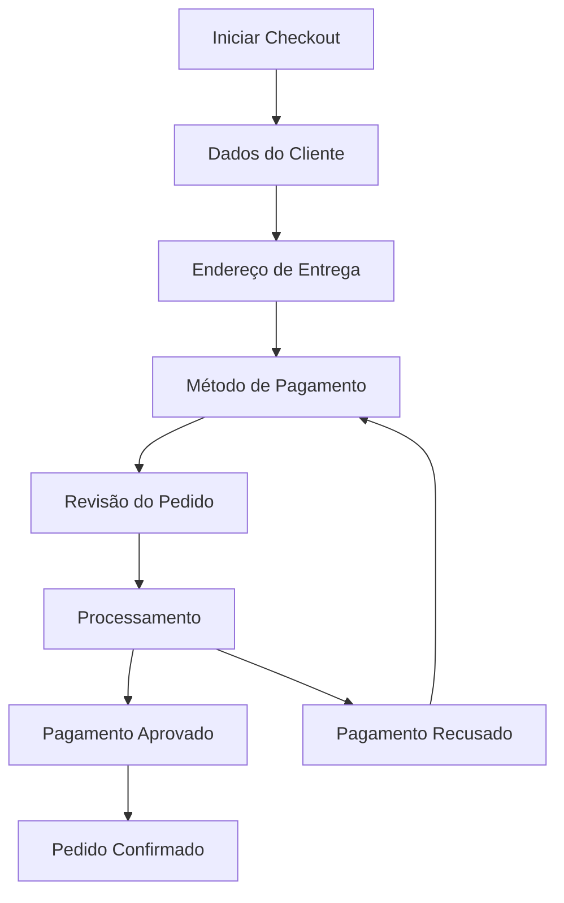

# Sistema de Checkout e Pagamentos

Este módulo implementa um sistema completo de checkout e integração com métodos de pagamento para a plataforma de produtos personalizados.

## Funcionalidades

### 🛒 Checkout
- Início de checkout a partir do carrinho ou itens diretos
- Coleta e validação de dados do cliente
- Gerenciamento de endereços de cobrança e entrega
- Aplicação de cupons de desconto
- Cálculo automático de frete
- Validações completas em cada etapa

### 💳 Métodos de Pagamento

#### PIX
- Geração de QR Code EMV
- Chave PIX dinâmica
- Expiração configurável (padrão: 30 minutos)
- Webhook para confirmação automática
- Interface amigável com instruções

#### Cartão de Crédito/Débito
- Tokenização segura de dados
- Validação com algoritmo de Luhn
- Detecção automática de bandeira
- Parcelamento (até 12x)
- Simulação de aprovação/recusa

## Fluxo de Checkout



## Estados do Checkout

- `draft` - Checkout iniciado
- `customer_info` - Dados do cliente preenchidos
- `shipping_address` - Endereço de entrega definido
- `payment_method` - Método de pagamento selecionado
- `review` - Pedido em revisão
- `processing` - Processando pagamento
- `completed` - Checkout finalizado
- `expired` - Sessão expirada
- `cancelled` - Checkout cancelado

## API Endpoints

### Checkout Principal

```http
POST /checkout/start
GET /checkout/:checkoutId
PUT /checkout/:checkoutId/customer
PUT /checkout/:checkoutId/address
PUT /checkout/:checkoutId/payment-method
POST /checkout/:checkoutId/coupon
POST /checkout/:checkoutId/complete
```

### PIX

```http
POST /checkout/pix/create
GET /checkout/pix/status/:paymentId
POST /checkout/pix/cancel/:paymentId
POST /checkout/pix/webhook
```

### Cartão

```http
POST /checkout/card/tokenize
POST /checkout/card/process
GET /checkout/card/status/:paymentId
POST /checkout/card/cancel/:paymentId
```

## Exemplos de Uso

### 1. Checkout Completo com PIX

```typescript
// 1. Iniciar checkout
const checkout = await checkoutService.startCheckout(tenantId, userId, {
  items: [
    {
      productId: 'fotolivro-a4',
      quantity: 1,
      pages: 20,
    }
  ]
});

// 2. Dados do cliente
await checkoutService.updateCustomerData(tenantId, userId, checkout.id, {
  customer: {
    email: 'cliente@exemplo.com',
    firstName: 'João',
    lastName: 'Silva',
    document: '12345678901',
    phone: '11999999999'
  }
});

// 3. Endereço
await checkoutService.updateAddress(tenantId, userId, checkout.id, {
  shippingAddress: {
    cep: '01310-100',
    street: 'Av. Paulista',
    number: '1000',
    neighborhood: 'Bela Vista',
    city: 'São Paulo',
    state: 'SP',
    country: 'BR'
  }
});

// 4. PIX
await checkoutService.updatePaymentMethod(tenantId, userId, checkout.id, {
  paymentMethod: {
    type: 'pix',
    pixData: {
      pixKey: 'cliente@exemplo.com',
      pixKeyType: 'email'
    }
  }
});

// 5. Finalizar
const result = await checkoutService.completeCheckout(tenantId, userId, checkout.id, {
  acceptedTerms: true
});
```

### 2. Checkout com Cartão

```typescript
// 1. Tokenizar cartão
const tokenData = await cardIntegrationService.tokenizeCard({
  number: '4111111111111111',
  holderName: 'João Silva',
  expiryMonth: '12',
  expiryYear: '2025',
  cvv: '123'
});

// 2. Processar pagamento
const payment = await cardIntegrationService.processCardPayment(
  session,
  tokenData.cardToken,
  3 // 3 parcelas
);
```

## Validações

### Dados do Cliente
- Email obrigatório e válido
- Nome e sobrenome obrigatórios
- CPF/CNPJ obrigatório
- Telefone recomendado

### Endereço
- CEP obrigatório
- Rua, número, bairro obrigatórios
- Cidade e estado obrigatórios

### Cartão
- Validação com algoritmo de Luhn
- Data de validade não expirada
- CVV com 3-4 dígitos
- Nome do portador obrigatório

## Segurança

### Tokenização
- Dados sensíveis nunca armazenados
- Tokens com expiração
- Mascaramento de números de cartão

### Validações
- Sanitização de inputs
- Validação de tipos de dados
- Verificação de permissões

## Configuração

### Variáveis de Ambiente

```env
# PIX
PIX_PROVIDER=mock
PIX_WEBHOOK_SECRET=your-webhook-secret

# Cartão
CARD_PROVIDER=mock
CARD_ENCRYPTION_KEY=your-encryption-key

# Checkout
CHECKOUT_SESSION_TTL=3600
CHECKOUT_EXPIRY_HOURS=24
```

## Testes

### Executar Testes
```bash
npm run test checkout
npm run test:e2e checkout
```

### Dados de Teste

#### Cartões de Teste
- Visa: `4111111111111111`
- Mastercard: `5555555555554444`
- Amex: `378282246310005`

#### PIX de Teste
- Chave: `test@exemplo.com`
- Valor: Qualquer valor > 0

## Monitoramento

### Logs
- Todos os eventos são logados
- Dados sensíveis são mascarados
- Níveis: DEBUG, INFO, WARN, ERROR

### Métricas
- Taxa de conversão por método
- Tempo médio de checkout
- Taxa de abandono por etapa

## Roadmap

- [ ] Boleto bancário
- [ ] Carteira digital (PayPal, Apple Pay)
- [ ] Pagamento recorrente
- [ ] Split de pagamento
- [ ] Cashback e pontos
- [ ] Análise de fraude